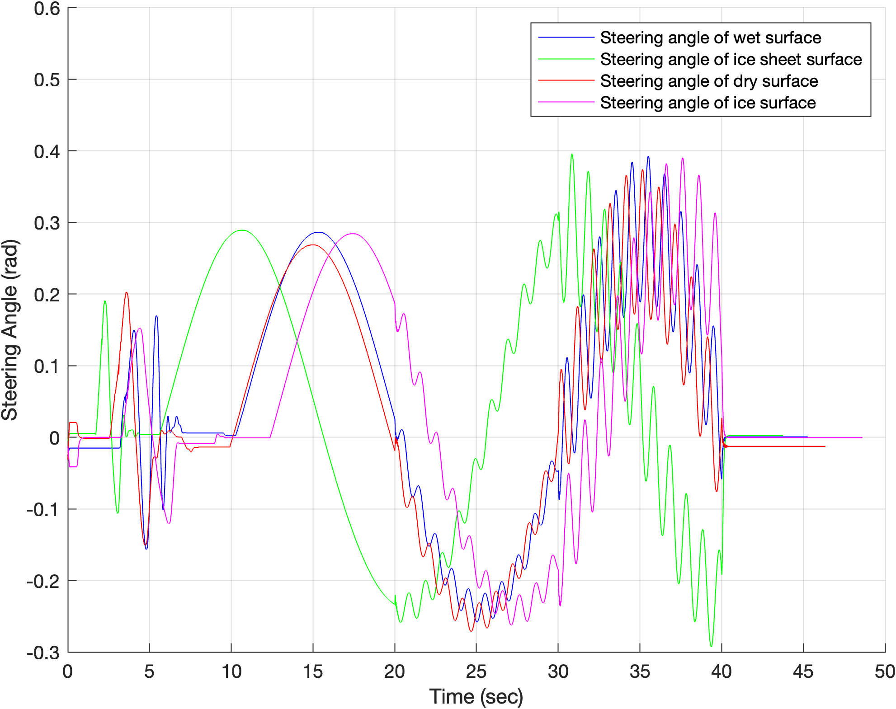
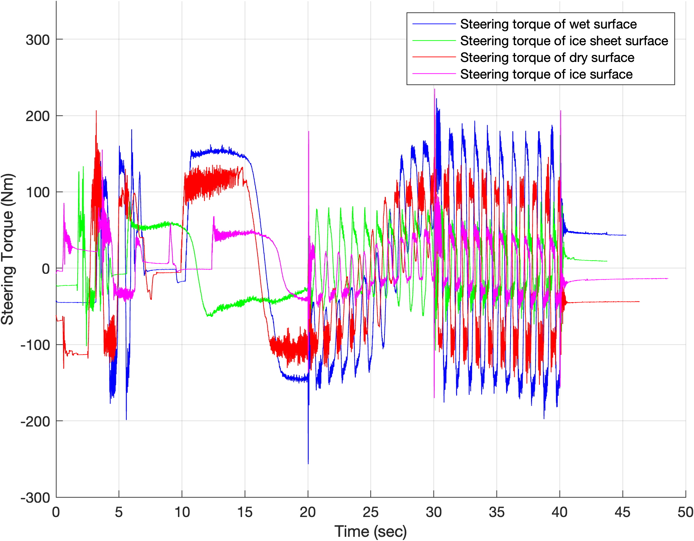
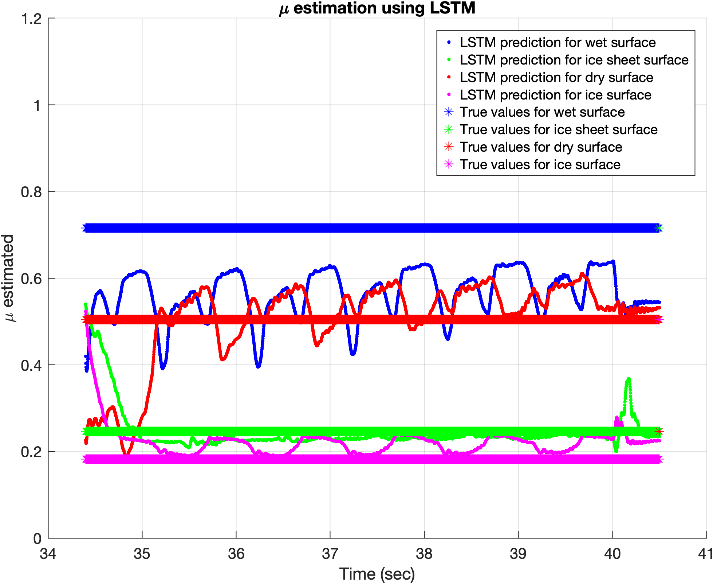
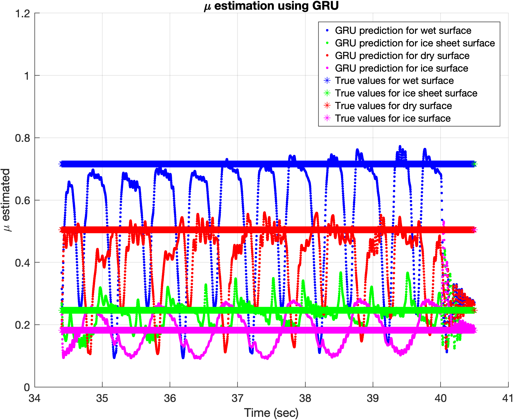

# Predicting Tire-Road Friction Coefficient Under High Steering Excitation
The tire friction coefficient plays a crucial role in determining a vehicle's ability to maneuver. In most driving situations, the friction forces between the tires and the road contribute significantly to the net forces acting on the vehicle, thereby influencing both its lateral and longitudinal movements. Consequently, it is vital for drivers, driver assistance systems, or autonomous vehicles to accurately estimate the friction coefficient that governs the interaction between the tires and the roadway. ([1,2])

This project focuses on predicting the tire-road friction coefficient, i.e. $\mu$ for a stationary vehicle under high steering excitation conditions using deep learning models, i.e. Long Short-Term Memory (LSTM) and Gated Recurrent Units (GRU). The models are trained with labeled (True) values of the friction coefficient (μ) obtained from a physical tire brush model, utilizing mean values to represent tire-road interactions accurately. The previous research on the tire brush models indicates that the physical model, i.e. tire brush model failed to estimate the tire road friction coefficient as a constant during high steering excitation.

Further, for simplicity the model predict the $\mu$ of only front tires. By capturing the temporal dependencies in the data, this approach enhances the prediction of the friction coefficient for stationary vehicles, contributing to better tire-road interaction models for various applications in vehicle dynamics and stability analysis. 

## Data
The following figures illustrate high steering excitations. For this project, only data from 10 seconds to 40.50 seconds is used.

## Input and Output of the model

- **Input**:
    - Left steering angles $\delta_l(t)$
    - right steering angles $\delta_r(t)$
    - Left steering torques
    - Right steering torques
    - Left steering rate $\dot\delta_l(t)$
    - Right steering rate $\dot\delta_r(t)$

- **Output**:
    - $\mu$

## Labeled $\mu$ values

- **Taking the mean of physical model, i.e. Tire Brush model**:
    - Wet surface: 0.715519
    - Ice sheet surface: 0.246479
    - Dry surface: 0.504774
    - Ice surface: 0.181976

## LSTM Architecture in MATLAB

- **Network Configuration**:
  - Predicts 1 response.
  - 6 features per time step.
  - 100 hidden units in LSTM layer.
  - Training: 500 epochs, mini-batches of 200.

- **Layers**:
  - Sequence Input Layer: 6 features.
  - LSTM Layer: 100 hidden units.
  - Fully Connected Layer: Maps to 1 response.

- **Training Options**:
  - Optimizer: Adam.
  - L2 Regularization: 1e-04.
  - Gradient Threshold: 10.
  - No shuffling.
  - Visualizes training progress.
  - Learning rate drops every 100 epochs.
  - Validation every 30 epochs.

- **Training Function**:
    - trainnet

## GRU Architecture in MATLAB

- **Network Configuration**:
  - Predicts 1 response.
  - 6 features per time step.
  - 200 hidden units in GRU layer.
  - Training: 500 epochs, mini-batches of 100.

- **Layers**:
  - Sequence Input Layer: 6 features.
  - GRU Layer: 200 hidden units.
  - Fully Connected Layer: Maps to 1 response.

- **Training Options**:
  - Optimizer: Adam.
  - L2 Regularization: 1e-04.
  - Gradient Threshold: 10.
  - No shuffling.
  - Visualizes training progress.
  - Learning rate drops every 100 epochs.
  - Validation every 30 epochs.

This concise summary highlights the key aspects of the GRU architecture and its training configuration.

- **Training Function**:
    - trainnet

## Prediction Using LSTM

## Prediction using the GRU

## Accuracy

- **LSTM accuracy**:
    - Root Mean Square Error : 0.1014
    - Mean Absolute Percentage Error: 16.9859

- **GRU accuracy**:
    - Root Mean Square Error : 0.1579
    - Mean Absolute Percentage Error: 21.3703

## Result

-   The LSTM model outperformed the GRU model in terms of both RMSE and MAPE, indicating better overall accuracy and reliability in predicting the coefficient of friction under the given conditions.

-   The GRU model's higher error rates and increased variability in predictions suggest it may be less suitable for this specific task compared to the LSTM model.

-    LSTM model, Exhibited overlapping predictions for different surfaces, particularly between dry and wet surfaces, and ice and ice sheet surfaces. This overlap makes surface classification more challenging with the LSTM model.

## References:
[1] Pacejka, Hans. Tire and vehicle dynamics. Elsevier, 2005.

[2] Beal, Craig E., and Sean Brennan. "Friction detection from stationary steering manoeuvres." Vehicle System Dynamics 58.11 (2020): 1736-1765.
